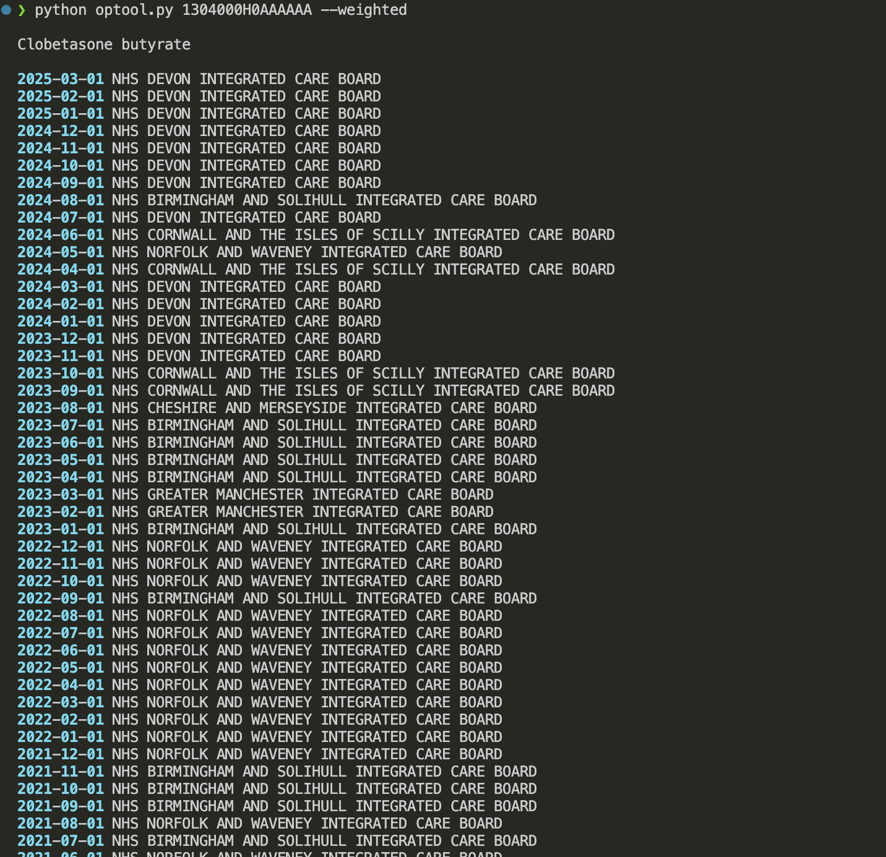
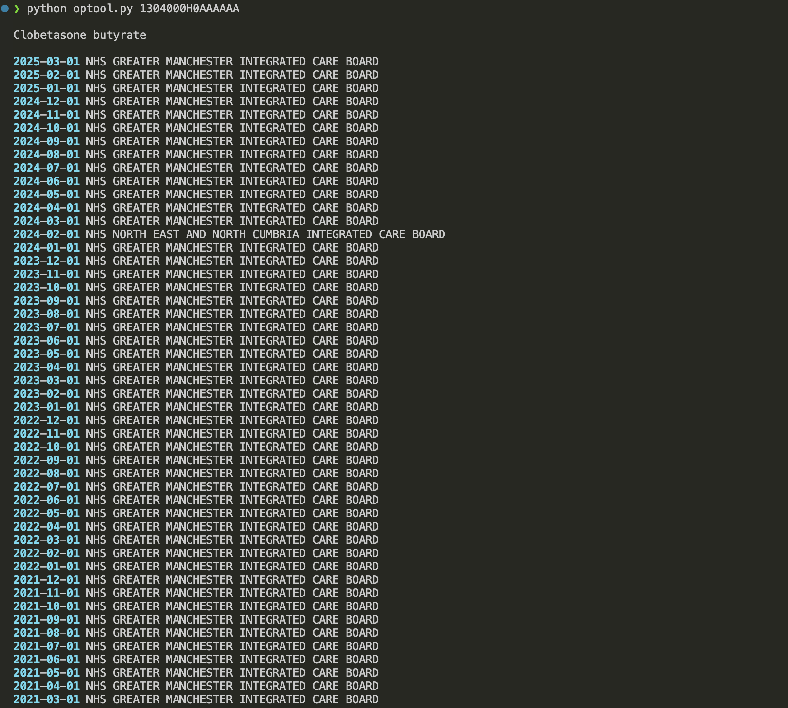
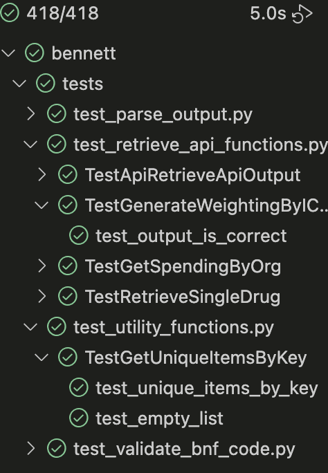

# Bennett Institute Technical Task <!-- omit in toc -->

## Table of contents <!-- omit in toc -->

- [System requirements](#system-requirements)
- [Installation](#installation)
  - [Venv environment (Optional, but advised)](#venv-environment-optional-but-advised)
  - [Installing the dependencies](#installing-the-dependencies)
- [Running the script](#running-the-script)
- [Code structuring notes](#code-structuring-notes)
- [Code Quality](#code-quality)
- [Code Success](#code-success)


## System requirements

- Python (This was written in a Python 3.12 environment, but will likely run in 3.11, and 3.10 too)
- POSIX compliant operating system, like a linux distribution or MacOSX.
- If you don't have a POSIX OS, then UTM or Docker can allow you to run a virtualised one (there is a Dockerfile, but this is for convenience, and I haven't used it or tested it!)

## Installation

### Venv environment (Optional, but advised)

Using a python virtual environment separates all the installed packages on your machine from the ones I've suggested to install, which can cause version clashes.

The recommendation I would make is to create a virtual environment using the inbuilt `venv` module, by executing the following command:

```sh
$ python -m venv .venv
```

and then

```
source .venv/bin/activate
```

At that point, you should be able to run `which python` and see a line output that ends in `.venv/bin/python`

### Installing the dependencies

For simplicity, I'm using `pip`, as it's included in the Python default distributions, so just run:

```sh
pip install -r requirements.txt
```

_Typically I would separate out requirements for dev and running requirements, but for a small scale tech test, I wouldn't do this._

This will run the installation of the dependencies, and provided it runs successfully, you'll have everything in place to run the solution.

## Running the script

The script is run by running the script as specified in [`PROBLEM.md`](PROBLEM.md), so can normally be run simply by running `python optool.py`, but it includes a [hashbang](https://en.wikipedia.org/wiki/Shebang_%28Unix%29), so many POSIX-compatible systems will be able to run it as just `optool.py`

```sh
python optool.py
```

You can also run the tests by running:

```sh
pytest
```

## Code structuring notes

- To allow separation of concerns, there is a module to contain separate files, but the `opcode.py` file is in the root directory as was implied in the problem description
- Unit testing is in the `tests` directory, which is also a module.
  - I chose to use `pytest`, as it makes some things easier, once the paradigms are understood.
- I've chosen to use `rich` and `Argparse` for the argument parsing, and presentation of output, as `Argparse` is built-in, and `rich` is something I'm familiar with from a CLI that I wrote in the past.
- Although normally I would use a more modern library like `httpx` that offers good asynchronous support for API calls, I've chosen to use `requests` on this occasion, because its fluent API is very straightforward to use.  Also, Kenneth, who made it, is quite a nice guy!
- I've tried to use typed code as much as possible to make it clear, even though in Python, type hints are sugar, and non-functional.

## Code Quality
- Ruff has been used to ensure that code meets _at least_ PEP8 standards
- Black has been used for zero-configuration formatting
- Pylance has been used for syntax highlighting of typing issues.
- Pytest has been used to run a largely test-first development approach
- Pytest-coverage has generated a coverage report, which show 92% coverage

## Code Success
Three pictures that should be reassuring!





The tests make one call to your API - but this is optional, and this test can fail without breaking the run.

There are 408 tests that run in 5s on a 3 year old Macbook.
